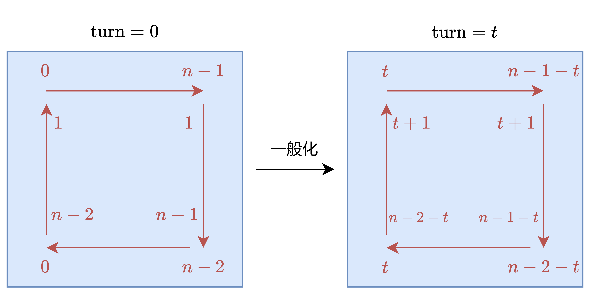
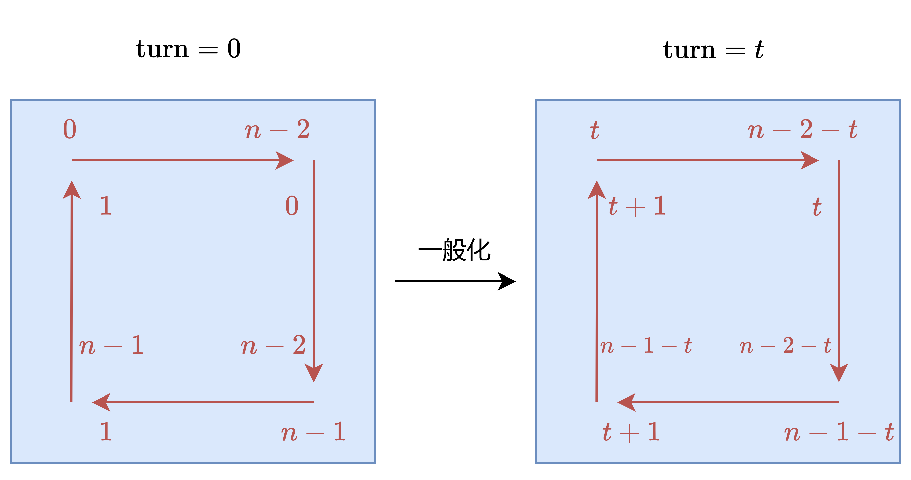

# 数组

在c++里数组的地址是连续的：

```c++
void test_arr() {
    int array[2][3] = {
            {0, 1, 2},
            {3, 4, 5}
    };
    cout << &array[0][0] << " " << &array[0][1] << " " << &array[0][2] << endl;  // 0x62fdd0 0x62fdd4 0x62fdd8（每个相差4字节byte）
    cout << &array[1][0] << " " << &array[1][1] << " " << &array[1][2] << endl;  // 0x62fddc 0x62fde0 0x62fde4
}
```

# 1. 二分查找

## 1.1 基础原理

给定一个 $n$ 个元素有序的（升序）整型数组 `nums` 和一个目标值 `target`  ，写一个函数搜索 `nums` 中的 `target`，如果目标值存在返回下标，否则返回 $-1$。

主要注意两点
1. 使用闭区间`[left, right]`，条件判断为`left <= right`。
2. 更新区间时，`left = middle + 1`和`right = middle - 1`，因为`middle`一定不是`target`。
3. 循环不变量：
`left`左侧`[0, left-1]`的所有元素均小于`target`。
`right`右侧`[right+1, nums.size()-1]`的所有元素均大于等于`target`
```c++
// 704.cpp
int search(vector<int> &nums, int target) {
    int left = 0, right = nums.size() - 1, middle;
    // 假设target在闭区间[left, right]，这样方便很多
    // 注意这里是<=，=的时候是一个元素
    while (left <= right) {
        middle = (left + right) / 2;  // 防止溢出可以用left + ((right - left) >> 1);
        if (nums[middle] > target)
            right = middle - 1;  // 因为是闭区间，可以确信middle不是target，因此区间更新为[left, middle - 1]。更进一步，middle及其右侧元素均大于target，所以更新后的right的右侧元素都大于target
        else if (nums[middle] < target)
            left = middle + 1;  // middle及其左侧元素均小于target，所以更新后的left的左侧元素都小于target
        else
            return middle;
    }
    return -1;
}
```

## 1.2 搜索插入位置
给定一个排序数组和一个目标值，在数组中找到目标值，并返回其索引。如果目标值不存在于数组中，返回它将会被按顺序插入的位置。 `// 35.cpp `

只需要把上面的`return -1`改成 **`return left`** 或者`return right + 1`即可。注意到循环终止条件，因此当循环结束时`left > right`，即`left = right + 1`。因为该return只可能是没查到数据的情况，所以有以下三种：
1. 插入位置在最左侧，ans=0，此时`middle`必然查到`middle=0`且仍然大于`target`，所以`right`减小到`-1`，此时`left=0`，即：ans=left=right+1=0。
2. 插入位置在最右侧，ans=n，此时`middle`必然查到`middle=n-1`且仍然小于`target`，所以`left`增大到`n`，此时`right=n-1`，即：ans=left=right+1=n。
3. 插入位置在中间，若`target`过大，需要往右，刚好`left`是往右的（所以`right`要+1）；`target`过小时，就选择当前节点插入，`right`是往左的（所以要+1），`left`不变。所以就是选`left`。

简而言之，目标值不存在时的插入位置等价于第一个比目标值大的元素的索引，因此可以直接返回`left`。
注意循环不变量为：`nums[left-1] < target，nums[right+1] > target`。


## 1.3 在排序数组中查找元素的第一个和最后一个位置
给你一个按照非递减顺序排列的整数数组 `nums`，和一个目标值 `target`。请你找出给定目标值在数组中的开始位置和结束位置。如果数组中不存在目标值 `target`，返回$[-1, -1]$。

**方法1（扩展法$O(n)$）：**
可以把二分查找的取等情况(`else`)中改为：
```cpp
// 33.cpp
int l = middle, r = middle;
while (r < nums.size() and nums[r] == target)
    r++;
while (l >= 0 and nums[l] == target)
    l--;
return vector<int>{l+1, r-1};
```
也就是说，当找到`target`时，向左右两边扩展，直到不是`target`为止。

**方法2-1（两次二分查找$O(\log n)$）：**
分别找到第一个`target`和最后一个`target`的位置。
当`lower`为`true`时，`right`减小条件为`nums[middle] >= target`，因此找到第一个`target`的位置；
当`lower`为`false`时，`right`减小条件为`nums[middle] > target`，找到最后一个`target`的位置。
```cpp
//34_2.cpp
class Solution {
public:
    int binarySearch(vector<int> &nums, int target, bool lower) {
        int left = 0, right = nums.size() - 1, ans = nums.size();
        while (left <= right) {
            int mid = (left + right) / 2;
            // 如果lower为True，条件为>=，那么right会一直减到<target，ans就是第一个>=target的下标
            if (nums[mid] > target || (lower && nums[mid] >= target)) {
                right = mid - 1;
                ans = mid;
            } else {
                left = mid + 1;
            }
        }
        return ans;
    }

    vector<int> searchRange(vector<int> &nums, int target) {
        int leftIdx = binarySearch(nums, target, true);  // target的一个下标
        int rightIdx = binarySearch(nums, target, false) - 1;  // 这是第一个>=target的前一个下标，也就是target的最后一个下标
        // 这里的条件只写leftIdx <= rightIdx都能通过
        if (leftIdx <= rightIdx && rightIdx < nums.size() && nums[leftIdx] == target && nums[rightIdx] == target) {
            return vector<int>{leftIdx, rightIdx};
        }
        return vector<int>{-1, -1};
    }
};
```

**方法2-2：**
这里借鉴`searchInsert`的思路。仅将其改动为`if (nums[mid] >= target)`，这时候查找的是第一个`>=target`的位置。然后再找第一个`<=target`的位置，(假设$\text{nums}[i] \in \mathbb{N} $)即第一个`>target`的位置的前一个位置`lower_bound(nums, target + 1) - 1;`。

循环不变量：`nums[left-1] < target，nums[right+1] >= target`
```cpp
// 34_3.cpp
class Solution {
    // lower_bound 返回最小的满足 nums[i] >= target 的下标 i
    // 如果数组为空，或者所有数都 < target，则返回 nums.size()
    int lower_bound(vector<int> &nums, int target) {
        int left = 0, right = (int) nums.size() - 1;
        while (left <= right) {
            int mid = (left + right) / 2;
            if (nums[mid] >= target) {
                right = mid - 1; // 范围缩小到 [left, mid-1]
            } else {
                left = mid + 1; // 范围缩小到 [mid+1, right]
            }
        }
        // 此时 nums[left-1] < target 而 nums[left] = nums[right+1] >= target，所以 left 就是第一个 >= target 的元素下标
        return left;
    }
public:
    vector<int> searchRange(vector<int> &nums, int target) {
        int start = lower_bound(nums, target);
        if (start == nums.size() || nums[start] != target) {
            return {-1, -1}; // nums 中没有 target
        }
        int end = lower_bound(nums, target + 1) - 1;  // 如果 start 存在，那么 end 必定存在。如果 ≥target+1 的第一个数不存在，那么n-1就是target，返回值就是n，再-1就是n-1，依然正确。
        return {start, end};
    }
};
```


## 1.4 $x$ 的平方根 
给你一个非负整数 $x$ ，计算并返回 $x$ 的 算术平方根 。
由于返回类型是整数，结果只保留 整数部分 ，小数部分将被 舍去 。
```cpp
// 69.cpp
int mySqrt(int x) {
        int left = 0, right = x;
        long long middle;
        while (left <= right) {
            middle = (left + right) / 2;
            if (middle * middle < x)
                left = middle + 1;
            else if (middle * middle > x)
                right = middle - 1;
            else
                return middle;  // 查到
        }
        return left - 1;  // 当循环结束时，left的位置是第一个大于目标平方根的位置，即left^2 > x，所以返回left-1。同理可以return right;
    }
```
该题其实等价于1.2的`searchInsert`改为`return left-1`，因为`searchInsert`是找第一个`>=target`的位置，而这里是找$\left \lfloor \sqrt x \right \rfloor $。


## 1.5 有效的完全平方数
给你一个正整数`num`。如果 `num` 是一个完全平方数，则返回 `true` ，否则返回 `false` 。`// 367.cpp` 简单题
与1.4代码逻辑一致，仅将`return middle`改为`return true`，`return left-1`改为`return false`。


# 2. 双指针

## 2.1 移除元素

给你一个数组`nums` 和一个值 `val`，你需要 `原地` 移除所有数值等于 `val` 的元素。元素的顺序可能发生改变。然后返回 `nums` 中与 `val` 不同的元素的数量。
假设 `nums` 中不等于 `val` 的元素数量为 $k$，要通过此题，您需要执行以下操作：
更改 `nums` 数组，使 `nums` 的前 $k$ 个元素包含不等于 `val` 的元素。`nums` 的其余元素和 `nums` 的大小并不重要。返回 $k$。

**方法1（暴力方法）：**
```cpp
// 27.cpp
int removeElement(vector<int> &nums, int val) {
    int size = nums.size();
    for (int i = 0; i < size; i++) {
        if (nums[i] == val) {
            for (int j = i + 1; j < size; j++)
                nums[j - 1] = nums[j];  // 发现需要移除的元素，就将数组集体向前移动一位
            i--; // 因为下标i以后的数值都向前移动了一位，所以i也向前移动一位，这样才能保证i不变，以确保在下一次循环中重新检查新的当前位置的元素（以免前移的元素还是val）
            size--; // 此时所求的数组的大小-1
        }
    }
    return size;
}
```
注意`for`里面的边界也是`size`，这样超过`size`的那些“不重要”的元素就不会被访问到。

**方法2-1（双指针）：**
```cpp
// 27_2.cpp
int removeElement(vector<int>& nums, int val) {
    int slow = 0;
    for (int fast = 0; fast < nums.size(); fast++) {
        // 跑得快的那个先去寻找共同目标
        if (nums[fast] != val) {
            nums[slow++] = nums[fast];  // 如果找到了就送给跑得慢的那个，然后跑得慢的也离目标近一点
        }
    }
    return slow;  // 跑得快的一直奔跑到生命的尽头后，最终留下跑得慢的一方
}
```

起初，如果`nums[fast] != val`，那么双方都会前进（此时`nums[slow] = nums[fast]`相当于无效语句。
一旦，`nums[fast] == val`，那么`fast`会继续**前进**，而`slow`会**停留**在原地，直到下一次找寻到共同目标（`nums[fast] != val`）。这时`fast`会把**共同目标**`nums[fast]`送给`slow`，让`slow`再次前进。
`fast`无论遇到什么都会前进，直到尽头。

简而言之：
- 快指针：指向**将要处理**的元素，寻找目标元素`target`，这里是不等于`val`的元素。
- 慢指针：指向**将要赋值**的位置，亦为`target`数组最后下标的位置。
- 循环不变量：$[0, \text{slow})$中的元素均不等于`val`。因此最终`slow`就是`target`数组的长度。

该方法不改变数组元素的相对位置。

**方法2-2（双指针）：**
```cpp
int removeElement(vector<int> &nums, int val) {
    int slow = 0, fast = nums.size() - 1;
    // 众里寻他千百度，蓦然回首，那人却在灯火阑珊处
    while (slow <= fast) {
        // 如果slow找错了，那就请fast给一个值（但也不一定是目标值）
        if (nums[slow] == val) {
            nums[slow] = nums[fast--];
        } else {
            slow++;  // slow前进一步
        }
    }
    return slow;
}
```

方法2-1在最坏情况下(没有元素等于`val`)，快慢指针各遍历了数组一次$O(n)$。但假如第一个元素就是`val`，那后面的全部元素都要左移一位。
方法2-2在最坏的情况下合起来只遍历了数组一次，并且适合`val`较少的情况。


## 2.2 删除有序数组中的重复项
给你一个 非严格递增排列 的数组 `nums` ，请你 `原地` 删除重复出现的元素，使每个元素 `只出现一次` ，返回删除后数组的新长度。
元素的 `相对顺序` 应该保持 一致 。然后返回 `nums` 中唯一元素的个数。
考虑 `nums` 的唯一元素的数量为 $k$ ，你需要做以下事情确保你的题解可以被通过：
更改数组 `nums` ，使 `nums` 的前 $k$ 个元素包含唯一元素，并按照它们最初在 `nums` 中出现的顺序排列。`nums` 的其余元素与 `nums` 的大小不重要。返回$k$ 。

```cpp
// 26.cpp
int removeDuplicates(vector<int> &nums) {
    int slow = 0, fast = 0;
    for (; fast < nums.size(); fast++) {
        if (nums[fast] != nums[slow]) {
            nums[++slow] = nums[fast];
        }
    }
    return slow + 1;  // 不考虑nums为空的情况（此时会错误返回1）
}
```
注意这里`slow+1`了，与2.1不同。2.1是$[0, \text{slow})$中的元素均不等于`val`，所以`slow`就是`target`数组的长度。而这里是$[0, \text{slow}]$中的元素均唯一，所以`slow+1`才是`target`数组的长度。


## 2.3 移动零
给定一个数组 `nums`，编写一个函数将所有 $0$ 移动到数组的末尾，同时保持非零元素的相对顺序。请注意 ，必须在不复制数组的情况下原地对数组进行操作。
```cpp
// 283.cpp 简单题
void moveZeroes(vector<int> &nums) {
    int slow = 0, fast = 0, size = nums.size();
    for (; fast < size; fast++) {
        if (nums[fast] != 0) {
            nums[slow++] = nums[fast];
        }
    }
    for (; slow < size; slow++) {
        nums[slow] = 0;
    }
}
```


## 2.4 比较含退格的字符串
给定 `s` 和 `t` 两个字符串，当它们分别被输入到空白的文本编辑器后，如果两者相等，返回 `true` 。`#` 代表退格字符。注意：如果对空文本输入退格字符，文本继续为空。

**方法1（栈）：**
该方法很好想出来，下面给出简洁的代码：
```cpp
// 844_2.cpp
class Solution {
public:
    bool backspaceCompare(string S, string T) {
        return build(S) == build(T);
    }

    string build(string str) {
        string ret;
        for (char ch: str) {
            if (ch != '#') {
                ret.push_back(ch);  // 添入末尾
            } else if (!ret.empty()) {
                ret.pop_back();  // 移除
            }
        }
        return ret;
    }
};
```
时间复杂度$O(S+T)$，空间复杂度$O(S+T)$。

**方法2-1（双指针）：**
```cpp
// 844_3.cpp
bool backspaceCompare(string S, string T) {
    int i = S.length() - 1, j = T.length() - 1;
    int skipS = 0, skipT = 0;  // skip 表示当前待删除的字符的数量（计数器）

    while (i >= 0 || j >= 0) {
        while (i >= 0) {
            if (S[i] == '#') {
                skipS++, i--;  // 如果char是#就可以抵消#前面的字符（使用skipS标志）
            } else if (skipS > 0) {
                skipS--, i--;  // skipS标志意味着当前char不应该被比较
            } else {
                break;  // 直到找到应该被比较的char（有效的char）才跳出
            }
        }
        while (j >= 0) {  // 逻辑同上
            if (T[j] == '#') {
                skipT++, j--;
            } else if (skipT > 0) {
                skipT--, j--;
            } else {
                break;
            }
        }
        if (i >= 0 && j >= 0) {
            if (S[i] != T[j]) {
                return false;  // 没越界就比较对应的char
            }
        } else {
            if (i >= 0 || j >= 0) {
                return false;  // i,j有一个越界了，但另一个还在，那肯定不相等（长度不等）
            }
        }
        i--, j--;  // 移动指针以进行下一次比较
    }
    return true;
}
```
这里双指针采用的反向的操作，这是因为后面的字符会影响前面的字符，从后往前就可以提前知道前面的字符是否被删除，而不是像栈那样需要后面的char判断需不需要`pop_back`。
时间复杂度$O(S+T)$，空间复杂度$O(1)$。

**方法2-2（双指针）：**
```cpp
// 844_4.cpp
class Solution {
public:
    string back(string ss) {
        int slow = 0;
        for (int fast = 0; fast < ss.length(); fast++) {
            if (ss[fast] != '#')
                ss[slow++] = ss[fast];  // 相当于push_back
            else if (slow > 0)
                slow--;  // 相当于pop_back

        }
        ss.resize(slow);  // 删除多余的部分
        return ss;
    }
    bool backspaceCompare(string s, string t) {
        return back(s) == back(t);
    }
};
```
这个双指针是传统的方法，跟栈类似。
`resize(num)`函数是将字符串的长度调整为`num`，多余的部分会被删除；缺少的部分会用空字符填充。


## 2.5 有序数组的平方
给你一个按 非递减顺序 排序的整数数组 `nums`，返回 每个数字的平方 组成的新数组，要求也按 非递减顺序 排序。
```cpp
// 977.cpp
vector<int> sortedSquares(vector<int> &nums) {
    int size = nums.size(), curr = size - 1;  // curr是当前位置
    vector<int> ans(size);  // 初始化一个大小为size的数组
    for (int left = 0, right = size - 1; left <= right; curr--) {
        if (nums[right] >= -nums[left]) {
            ans[curr] = nums[right] * nums[right];
            right--;
        } else {
            ans[curr] = nums[left] * nums[left];
            left++;
        }
    }
    return ans;
}
```
因为两侧的数据是最大的，所以从两侧开始比较，然后将较大的平方值放在`ans`的末尾。

对于条件判断处的证明：不妨记`nums[right]`为`a`，`nums[left]`为`b`，那么$a \geq -b$有三种情况：
1. $a \geq -b \geq 0$，此时$a^2 \geq a\cdot (-b) \geq (-b)^2$；
2. $a \geq 0 \geq -b$，此时$a, b$同号，由于`nums`是非递减的而`right>=left`，所以$a \geq b$；
3. $0 \geq a \geq -b$，该情况($b\geq 0 \geq a$)不可能出现，因为`nums`是非递减的。
注：为了理解简单，将条件判断改为`nums[right] * nums[right] >= nums[left] * nums[left]`也是可以的。


## 2.6 长度最小的子数组
给定一个含有 $n$ 个正整数的数组和一个正整数 `target` 。
找出该数组中满足其总和大于等于 `target` 的长度最小的子数组$[\text{nums}_l, \text{nums}_{l+1}, ..., \text{nums}_{r-1}, \text{nums}_r]$ ，并返回其长度。如果不存在符合条件的子数组，返回 $0$ 。

```cpp
// 209.cpp
int minSubArrayLen(int target, vector<int> &nums) {
    int size = nums.size();
    int slow = 0, fast = 0, ans = INT_MAX, sum = nums[slow];
    while (fast < size) {
        if (sum >= target) {
            ans = min(ans, fast - slow + 1);
            sum -= nums[slow++];  // 窗口左侧右滑，减小sum
        } else {
            if (++fast < size)
                sum += nums[fast];  // 窗口右侧右滑，增大sum
        }
    }
    if (ans == INT_MAX)
        return 0;  // 不存在符合条件的子数组
    return ans;
}
```

注：条件改为`while (fast < size && slow <= fast)`可以更快，因为一旦slow超过fast就说明有一个元素刚好比target大，所以ans肯定是1，不可能更小了。不写`slow <= fast`也是可以的，因为当`slow++`后`sum`变为$0$，那`fast`肯定会++了。

可以理解为左右指针中间窗口的`sum`为两指针的`共同财产`，就是右指针挣钱(往右移动)，当共同财产大过`target`时记录两指针距离，结果左指针挥霍(往右移动)，花钱到`sum`又小过`target`，此时右指针不得不再开始赚钱(向右移动)。周而复始，最后取左右指针离得最近的时候。

> 由于子数组越长，包含的元素越多，越不满足题目要求；反之，子数组越短，包含的元素越少，越满足题目要求。有这种单调性的题目，可以用滑动窗口解决。

## 2.7 水果成篮
`fruits[i]` 是第 `i` 棵树上的水果种类 。给定一个整数数组 `fruits`，你只能选择两种类型的水果，且必须连续采摘（从某棵树开始，向右连续采摘），求能收集的最大水果数。
```cpp
// 904.cpp
int totalFruit(vector<int> &fruits) {
    int size = fruits.size();
    unordered_map<int, int> cnt;
    int left = 0, ans = 0;
    for (int right = 0; right < size; ++right) {
        ++cnt[fruits[right]];  // 将当前水果fruits[right]加入哈希表cnt，并增加其计数。
        while (cnt.size() > 2) {
            auto it = cnt.find(fruits[left]); // 找到左边界水果在哈希表中的位置
            --it->second;  // 不断移动左边界left，减少当前左边界水果对应的计数
            if (it->second == 0) {
                cnt.erase(it);  // 如果某种水果计数为0则从哈希表中移除，直到哈希表大小不超过2，则窗口调整完毕。
            }
            ++left;  // 左边界右移
        }
        ans = max(ans, right - left + 1);  // 窗口大小为right - left + 1
    }
    return ans;
}
```
`first`与`second`是`pair`的第一,二个元素，`first`是key，`second`是value。当然，对应代码可以改为：
```cpp
            int out = fruits[left];
            cnt[out]--;
            if (cnt[out] == 0)
                cnt.erase(out);
```

因为题目限制$1\le $ `fruits.length` $\le 10^5$，所以可以直接用数组代替哈希表，只需要修改种类总数的判断：
```cpp
// 904_2.cpp
int totalFruit(vector<int> &fruits) {
    int size = fruits.size();
    int cnt[100001] = {0}; // 1 <= fruits.length <= 10^5
    int left = 0, ans = 0, kinds = 0;  // kinds记录当前水果种类的总数
    for (int right = 0; right < size; ++right) {
        if (cnt[fruits[right]] == 0)
            ++kinds;  // 水果种类的数量为0就增加
        ++cnt[fruits[right]];
        while (kinds > 2) {
            int out = fruits[left];
            cnt[out]--;
            if (cnt[out] == 0)
                --kinds;  // 水果种类的数量为0就删除掉
            ++left;
        }
        ans = max(ans, right - left + 1);
    }
    return ans;
}
```

## 2.8 最小覆盖子串
给你一个字符串 `s` 、一个字符串 `t` 。返回 `s` 中涵盖 `t` 所有字符的最小子串。如果 `s` 中不存在涵盖 `t` 所有字符的子串，则返回空字符串 `""` 。

```cpp
// 76.cpp
class Solution {
    // 辅助函数：判断当前窗口是否覆盖了t中的所有字符
    bool is_covered(int cnt_s[], int cnt_t[]) {
        for (int i = 'A'; i <= 'Z'; i++)
            if (cnt_s[i] < cnt_t[i])
                return false;  // 当前窗口中的字符数量不足，返回false
        for (int i = 'a'; i <= 'z'; i++)
            if (cnt_s[i] < cnt_t[i])
                return false;
        return true;
    }
public:
    string minWindow(string s, string t) {
        int size = s.length();
        int ans_left = -1, ans_right = size;  // 初始化最小窗口的左右边界为无效值
        int cnt_s[128]{};  // 记录s子串(当前窗口)中字符的出现次数，ASCII范围0-127
        int cnt_t[128]{};  // t中字符的出现次数
        for (char c: t)
            cnt_t[c]++;  // 统计t中每个字符的出现次数
        int left = 0;
        for (int right = 0; right < size; right++) { // 移动子串右端点
            cnt_s[s[right]]++; // 右端点字符移入子串
            while (is_covered(cnt_s, cnt_t)) { // 涵盖
                if (right - left < ans_right - ans_left) { // 找到更短的子串
                    ans_left = left;
                    ans_right = right; // 记录此时的左右端点
                }
                cnt_s[s[left]]--; // 左端点字母移出子串
                left++;  // 收缩窗口
            }
        }
        return ans_left < 0 ? "" : s.substr(ans_left, ans_right - ans_left + 1);  // [ans_left, ans_right]
    }
};
```
该方法还是传统的滑动窗口，只是这里使用的**缩小窗口的判断条件**是`is_covered`函数，比之前复杂一点；另外还需要**记录最小窗口的左右边界**。

下面的方法记录**差异**`cnt`，再用`less`记录窗口内有多少种字符的出现次数小于`t`，这样就可以**直接判断**是否覆盖了`t`中的所有字符，而不需要每次都遍历比较，将时间复杂度从$O(|\sum| \cdot s + t)$降低到$O(|\sum| + s + t)$。

```cpp
// 76_2.cpp
string minWindow(string s, string t) {
    int size = s.length();
    int ans_left = -1, ans_right = size;
    int cnt[128]{};  // 统计t中每个字符的出现次数
    int less = 0;  // 记录需要覆盖的字符种类数
    for (char c : t) {
        if (cnt[c] == 0)
            less++; //  less为t中的不同字母个数
        cnt[c]++;
    }
    int left = 0;
    for (int right = 0; right < size; right++) {
        char r_c = s[right];
        cnt[r_c]--; // 右侧字符移入窗口，差异减少
        if (cnt[r_c] == 0)
            less--;  // 原来窗口内 r_c 的出现次数比 t 的少，现在一样多，那就是满足要求了
        while (less == 0) { // 涵盖：所有字母的出现次数都是 >=
            if (right - left < ans_right - ans_left) { // 找到更短的子串
                ans_left = left;
                ans_right = right;
            }
            char l_c = s[left];
            if (cnt[l_c] == 0)
                less++;  // 左边界字符移出窗口前，若其差异为0，移出后会缺少该种类
            cnt[l_c]++; // 左侧字符移出窗口，差异增加
            left++;
        }
    }
    return ans_left < 0 ? "" : s.substr(ans_left, ans_right - ans_left + 1);
}
```
虽然临界条件都是`cnt[c]=0`，但`cnt[r_c] == 0`是在`cnt[r_c]--`之后，代表着`r_c`的出现次数比`t`的少，在差异`--`后就刚好满足要求；而`cnt[l_c] == 0`是在`cnt[l_c]++`之前，代表着`l_c`的出现次数和`t`一样多，差异`++`后就不满足要求了。因此前者是`less--`，后者是`less++`。


# 3. 其他
## 3.1 螺旋矩阵 II
给你一个正整数 $n$ ，生成一个包含 $1$ 到 $n^2$ 所有元素，且元素按顺时针顺序螺旋排列的 $n \times n$ 正方形矩阵 `matrix` 。
```cpp
// 59.cpp
vector<vector<int>> generateMatrix(int n) {
    int cur = 1, n2 = n * n;  // cur是当前生成的元素
    int turn = 0;  // 当前轮次
    vector<vector<int>> ans(n, vector<int>(n, 0));
    for (; cur <= n2; turn++) {
        for (int i = turn; i <= n - 1 - turn; i++)
            ans[turn][i] = cur++;
        for (int i = turn + 1; i <= n - 1 - turn; i++)
            ans[i][n - 1 - turn] = cur++;
        for (int i = n - 2 - turn; i >= turn; i--)
            ans[n - 1 - turn][i] = cur++;
        for (int i = n - 2 - turn; i >= turn + 1; i--)
            ans[i][turn] = cur++;
    }
    return ans;
}
```
上述写法采用**左闭右闭**区间，可由`turn=0`的图像递推得出`turn=t`轮次的边界。注意到每轮边界的左右范围都减$1$，所以使用`turn`是合理的：
<div style="display: flex; justify-content: center; align-items: center;">
    <div style="text-align: center;">
        
    </div>
</div>

下述写法采用**左闭右开**区间，如图：

<div style="display: flex; justify-content: center; align-items: center;">
    <div style="text-align: center;">
        
    </div>
</div>

其在形式上更规整，因为每一轮的四段的长度是相等的的，代码如下：

```cpp
// 59_2.cpp
vector<vector<int>> generateMatrix(int n) {
    int cur = 1, n2 = n * n;  // cur是当前生成的元素
    int turn = 0;  // 当前轮次
    vector<vector<int>> ans(n, vector<int>(n, 0));
    for (; cur < n2; turn++) {
        for (int i = turn; i < n - 1 - turn; i++)
            ans[turn][i] = cur++;
        for (int i = turn; i < n - 1 - turn; i++)
            ans[i][n - 1 - turn] = cur++;
        for (int i = n - 1 - turn; i > turn; i--)
            ans[n - 1 - turn][i] = cur++;
        for (int i = n - 1 - turn; i > turn; i--)
            ans[i][turn] = cur++;
    }
    if (n % 2 != 0) {
        ans[n / 2][n / 2] = cur;
    }
    return ans;
}
```

注意有区别：这里写的是`cur < n2`，并有额外的`n % 2 != 0`的判断。
首先应该了解的是：记最后一次`turn`$=T$,那么有$T = \left \lfloor n \right \rfloor $，问题出在$n$为奇数的时候，$2T+1=n$，所以最后一次`turn`的时候，使用`cur < n2`会导致`ans[n/2][n/2]`没有被赋值。

以 **`n=3`** 为例，未被赋值的是`ans[1][1]=5`（此时$T=1$，该行被赋值的元素有$2\times T = 2$个，所以剩中间那个未被赋值）。
对于代码1：`int i = turn; i <= n - 1 - turn;`，其循环的区间长度为$n-1-T-T+1$，由于$2T+1=n$，那么**该循环能进行一次**，所以`ans[1][1]=5`被赋值。对于`int i = turn + 1; i <= n - 1 - turn;`，循环的区间长度为$0$，所以不会进入循环，后面类似。（其实可以从图上看出第一段的长度比第二三段长$1$）
对于代码2：`int i = turn; i < n - 1 - turn;`，其循环的区间长度为$n-1-T-T=0$，所以**不会进入循环**，后面类似。（从图上可以看出1~4段的长度均相等）也就是说，如果写为`cur < n2`，那么会一直跳过循环，导致`cur`无法`++`，因此死循环。


注：**二维矩阵的输出模版代码**：
```cpp
for (auto &an: ans) { // 遍历每一行
    for (int j: an) { // 遍历每一列
        cout << j << " ";
    }
    cout << endl;
}
```


## 3.2 螺旋矩阵
给你一个 $m$ 行 $n$ 列的矩阵 `matrix` ，请按照顺时针螺旋顺序 ，返回矩阵中的所有元素。

该题的判断条件与3.1基本一致，仅多了`m≠n`的情况：
```cpp
// 54.cpp
vector<int> spiralOrder(vector<vector<int>> &matrix) {
    int m = matrix.size();  // 行数
    int n = matrix[0].size();  // 列数
    int cur = 1, mn = m * n;  // cur是当前读取的元素
    int turn = 0;  // 当前轮次
    vector<int> ans;
    for (; cur <= mn; turn++) {
        for (int i = turn; i <= n - 1 - turn; i++, cur++)
            ans.push_back(matrix[turn][i]);
        for (int i = turn + 1; i <= m - 1 - turn; i++, cur++)
            ans.push_back(matrix[i][n - 1 - turn]);
        if (cur > mn)
            break;  // 以n>m为例，此时还能横着走一次，但不能再转弯走回去了（不然这一行就会重复输出）
        for (int i = n - 2 - turn; i >= turn; i--, cur++)
            ans.push_back(matrix[m - 1 - turn][i]);
        for (int i = m - 2 - turn; i >= turn + 1; i--, cur++)
            ans.push_back(matrix[i][turn]);
    }
    return ans;
}
```
这里多了个条件判断是其实与3.1方法二中对中心点的处理一样的逻辑，在转完圈后单独考虑最后的剩的那一行或一列。而使用`cur <= mn`的条件应该是判断不要多考虑了那一行或一列。